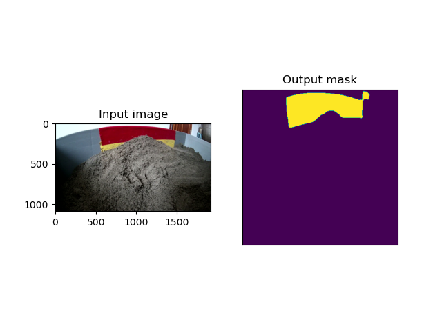
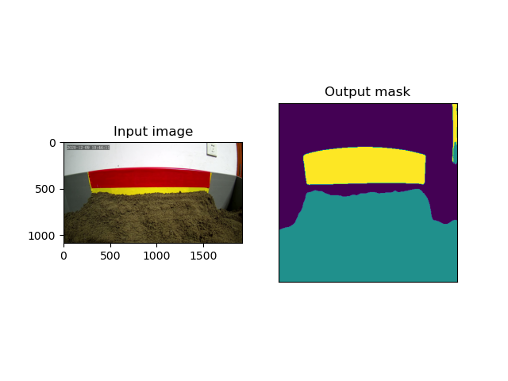

# 基于U-Net的语义分割
# Semantic segmentation based on U-Net
基于[Pytorch-UNet](https://github.com/milesial/Pytorch-UNet)修改。

> * - [x] Single class
> * - [x] Multi-class


## Dependency
- pytorch==1.5.1
- pillow==5.3.0
- numpy==1.19.1
- matplotlib==3.2.2
- imgviz==1.2.3

## Train
### 1. Train with single class and background
```
python train.py \ 
    --img_dir=./data/imgs
    --mask_dir=./data/masks
    --save_dir=./checkpoints \ 
    --rgb \
    --classes=1 \ 
    --epochs=50 \ 
    --val_percent=0.5 \ 
    ......
```

### 2. Train with N classes and background
```
python train.py \ 
    ......
    --classes=N+1 \ 
    ......
```

### 3. Train with pretrained model or finetune
```
python train.py \ 
    ......
    --model_dir=./checkppints/model.pth
    ......
```

## Inference
```
python predict.py \ 
    --model=./checkpoints/49.pth \ 
    --input_dir=./demo \ 
    --viz \ 
    --no-save \ 
    --rgb \ 
    --classes=N
```
* `--viz`: visualize the predict result.
* `--no-save`: Dont not save the predict result.

## Some Visualization Result




## Label generate
Use [labelme](https://github.com/wkentaro/labelme) to label your image.

Install labelme: ```pip install labelme``` or install it from source.

Then run json_to_dataset.py to convert json file to png mask:
```
python json_to_dataset.py \
    --json_file=xxx.json
    --out=output_dir
```
If you want to batch convert json file or to generate xxx.yaml file, 
please refer: 
[labeme批量转化json 未生成info.yaml解决办法](https://blog.csdn.net/weixin_43410539/article/details/104372086).
